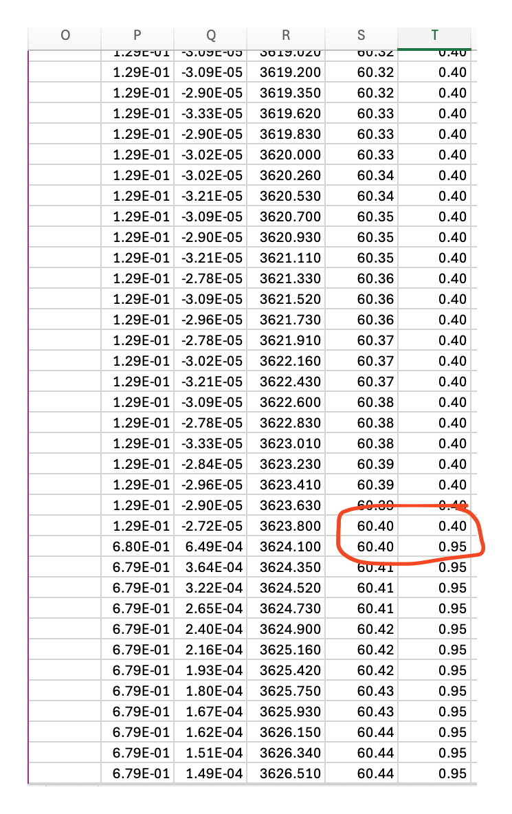
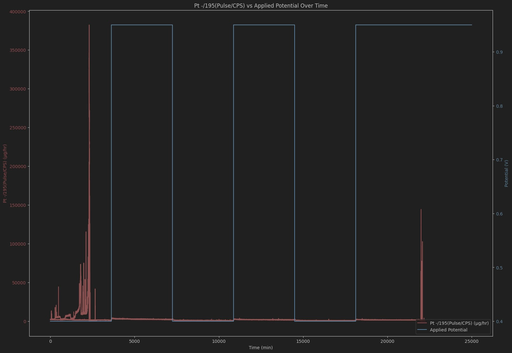

Hi Nancy, 

I hope you're having a nice weekend. 

I spotted something as to why we might be seeing the slight discrepancy between our data. The manually processed data has a change in the applied voltage at around 60.40 minutes. However, my code is set to start this at EXACTLY after 3600 seconds have passed. These some forty extra data points might be causing the graph to look slightly off as we were seeing in my demonstration on Friday. In figure 1, you can see the change in the applied voltage at around 60.40 minutes.

Looking further into the data, I also noticed that this change at 60.40 minutes is consistent with the next change at 120.40 minutes, and so on.
Since there are three cycles, we have $3 \times 40 = 120$ extra data points in the manually processed data being visualized as a part of some voltage $v_i \in \textbf{voltages}$. This would result in a slight discrepancy in the graph, as the code is not accounting for these extra points.

If we instead adjust the code to start processing the data at
60.40 minutes, we should be able to align the graphs more closely:

First, let's find how many seconds 60.40 minutes is:
 $$
60.40\ \text{minutes} = \left( \frac{60.40\ \text{min}}{1} \right) \times \left( \frac{60\ \text{s}}{1\ \text{min}} \right)
=3624 \text{ s}$$

After graphing using the new period $T = 3624$ seconds, I generated the graph visualized in figure 2. 

Let me know if this helps clarify the discrepancy. If you have any further questions or need additional adjustments, feel free to reach out.

Thank you,

Bhagawat Chapagain